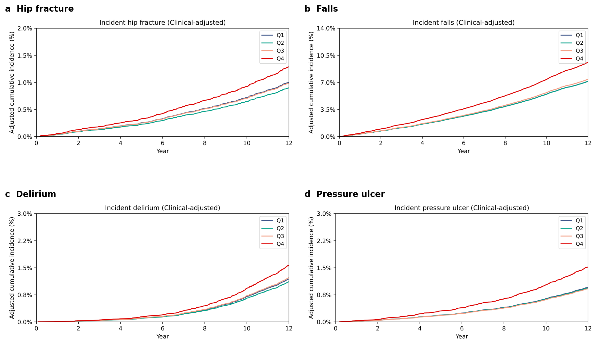

# Circulating endotrophin marks accelerated aging across frailty, multimorbidity and mortality in the UK Biobank

**Running title:** Endotrophin and accelerated aging

**Word count.** Abstract 152; main text ~5,300.

---

## Abstract

Endotrophin, the C-terminal cleavage fragment of the type VI collagen alpha3 chain (COL6A3), drives fibrosis, low-grade inflammation and tissue remodelling -- processes increasingly recognised as proximal hallmarks of biological aging. Whether circulating endotrophin tracks the integrated programme of aging across frailty, multimorbidity and mortality in a general population has not been established. In 44,642 UK Biobank participants with Olink Explore 3072 plasma proteomics and up to 13.7 years of hospital-record and mortality follow-up, one standard-deviation higher baseline endotrophin was associated with 32 % higher all-cause mortality, 22 % higher rate of an incident Hospital Frailty Risk Score-positive admission, and graded compression of the eight-event healthspan composite, after adjustment for age, sex, body-mass index, smoking, blood pressure, glycaemia, lipids, kidney function, C-reactive protein and N-terminal pro-B-type natriuretic peptide. Each frailty-syndrome hospitalisation, the leading age-related diseases and a cross-sectional bio-age proxy showed the same monotonic dose-response. Endotrophin behaves as a single circulating index of accelerated aging.

---

## Introduction

The biology of aging is now organised around a small number of interconnected hallmarks -- chronic low-grade inflammation, cellular senescence, dysregulated nutrient sensing, mitochondrial dysfunction and altered intercellular communication -- that together drive the age-related rise in chronic disease, frailty and mortality.[1,2] Two operational concepts have emerged from this framework. **Frailty**, the loss of physiological reserve, is captured at scale either by Fried's physical-frailty phenotype[3] or by deficit-accumulation indices such as the Williams 49-item Frailty Index[4] and the electronic-health-record-based Hospital Frailty Risk Score (HFRS).[5] **Healthspan**, the period of life lived without major chronic disease, has been operationalised by Zenin and colleagues as the time to the first of eight events (heart failure, myocardial infarction, chronic obstructive pulmonary disease, stroke, dementia, diabetes, cancer or death),[6] a definition that has since underpinned several genome-wide and proteome-wide aging-discovery efforts.

What is less clear is which **circulating molecules** integrate these aging programmes -- that is, which biomarkers track frailty, the disease panel and mortality simultaneously rather than only one of them. Plasma proteomics in the UK Biobank has produced strong leads for individual diseases, including the GDF15-NPPB-CHIT1 axis for heart failure,[7,8] proteomic risk scores for cardiovascular outcomes,[9] and a proteomic biological-age clock that beats chronological age for mortality prediction.[10,11] But few candidates have been tested against the integrated geriatric phenotype (frailty + healthspan + cause-specific morbidity), and even fewer survive adjustment for the established clinical and biomarker risk factors that multivariable models routinely deploy. Of particular importance is whether a candidate adds information beyond CRP and N-terminal pro-B-type natriuretic peptide (NT-proBNP) -- two of the most widely used circulating markers of systemic inflammation and cardiac stress, respectively.

Endotrophin is a strong biological candidate.[12,13] It is the C-terminal cleavage fragment of the type VI collagen alpha3 chain (COL6A3), released by furin during intracellular maturation of collagen VI. In tissues from adipose to kidney to myocardium, endotrophin promotes transforming-growth-factor-beta signalling, extracellular-matrix expansion, macrophage infiltration and endothelial-to-mesenchymal transition.[12,13,14] Circulating endotrophin has been linked to insulin resistance,[15] non-alcoholic fatty liver disease,[16] chronic kidney disease (CKD),[17,18] heart failure (HF) outcomes in HFpEF cohorts,[19] and incident CKD[20] and incident HF[21] in our previous UK Biobank Pharma Proteomics Project (UKB-PPP) work. Yet whether endotrophin tracks the **broader** programme of biological aging -- frailty, healthspan and the panel of leading age-related diseases -- independently of CRP and NT-proBNP, has not been tested at scale. The motivating intuition is that connective-tissue remodelling and the molecular machinery that produces endotrophin sit upstream of, rather than parallel to, many of the hallmarks of aging.

Here we use Olink Explore 3072 measurements in 44,642 UK Biobank participants with up to 13.7 years of linked Hospital Episode Statistics (HES) and mortality follow-up to test whether baseline endotrophin (col6a3 NPX) is associated with: (i) cross-sectional indices of frailty, multimorbidity and biological age; (ii) all-cause mortality and time-to-first HFRS-positive admission as primary prospective outcomes; (iii) the Zenin healthspan composite and the four constituent frailty-syndrome hospitalisations (hip fracture, falls, delirium, pressure ulcer) modelled separately; and (iv) cumulative cardiovascular and cancer events alongside an incident-disease panel comprising heart failure, type-2 diabetes, CKD and dementia. **Our pre-specified primary analysis is the "Clinical + Biomarkers" model**, which adjusts for the full clinical covariate set *and* CRP *and* NT-proBNP, so that any residual endotrophin signal cannot be explained by these two established channels of inflammation and cardiac stress. Sparser nested models (Base; Clinical without CRP / NT-proBNP) are presented as sensitivity analyses in the Supplementary Materials.

---

## Results

### Cohort and exposure distribution

The analytic cohort comprised **44,642 UK Biobank participants** with valid baseline endotrophin (col6a3, Olink Explore 3072 NPX) and core covariates after minimal exclusion of 837 participants for missing endotrophin and 0 for missing core covariates from a starting set of 45,479 (Methods, **Supplementary Table S5**). Median follow-up was 13.7 years through linked Hospital Episode Statistics (HES) and the National Death Register. Baseline endotrophin was approximately normally distributed (mean 0.027 NPX, SD 0.42), and per-SD effects below correspond to a one-SD increment within the cohort. The Clinical-plus-Biomarkers analytic risk set (i.e. participants additionally having non-missing CRP and NT-proBNP) numbered 27,912 - 33,527 depending on per-endpoint prevalent-case removal.

### Endotrophin tracks baseline frailty and multimorbidity

We first asked whether elevated endotrophin already accompanies frailty and multimorbidity at the time of baseline measurement (**Fig. 1**, **Supplementary Tables S1-S3**).

Baseline cumulative HFRS, computed as the sum of the 109 Gilbert *et al.* 2018 weights[5] over distinct three-character ICD-10 codes recorded in the two years before the assessment-centre visit, increased by **beta = +0.131 HFRS units per 1-SD endotrophin** in the Clinical-plus-Biomarkers model (95 % CI 0.118 - 0.143; *P* = 2.4e-96; *n* = 33,527). The signal was robust to log-transformation of the outcome (beta = +0.115 on the log scale) and remained essentially unchanged from sparser adjustments (beta = +0.141 in Clinical-only, beta = +0.127 in Base).

Prevalent frailty-syndrome ICD codes recorded at or before baseline showed the same pattern: per-SD endotrophin was associated with **OR 2.27 (1.78 - 2.88)** for prior hip fracture, **1.29 (1.18 - 1.40)** for prior falls and **1.33 (1.22 - 1.45)** for any prior frailty syndrome (all Clinical-plus-Biomarkers). Prevalent delirium (5 cases) and pressure ulcer (14 cases) were too sparse for stable estimation.

The dose-response was visible in the raw HFRS distribution: the proportion of participants with HFRS = 0 (i.e. no relevant ICD code in the two-year baseline window) fell from 94.5 % in ETP quartile 1 to 86.2 % in quartile 4, while the proportion crossing the Gilbert intermediate-risk threshold (HFRS >= 5) rose from 0.35 % in Q1 to 1.58 % in Q4 -- a ~4.5-fold increase (**Suppl. Fig. S0**). Across all 44,642 participants, the cumulative HFRS distribution shifted markedly during follow-up (**Fig. 1a**): the share with HFRS = 0 fell from 91.6 % at baseline to 47.1 % at year 12, while the share with HFRS >= 5 rose from 0.7 % to 20.1 %.

Two parallel multimorbidity counts reinforced the result: per-SD endotrophin was associated with a **2.4 % rise** in self-reported chronic-condition count (RR 1.024, 1.008 - 1.040; *P* = 2.6e-3) and a **16 % rise** in prevalent ICD-defined disease count across eight common conditions (HF, MI, COPD, stroke, dementia, T2D, cancer, CKD; RR 1.16, 1.12 - 1.20; *P* = 4.8e-19), in the Clinical-plus-Biomarkers model. A composite biological-age proxy -- a sign-flipped z-sum of age, eGFR, CRP, HbA1c, HDL-C, total cholesterol and NT-proBNP -- also rose monotonically with endotrophin (beta = +0.43 SD per 1-SD endotrophin; *P* < 1e-300).

![Figure 1 -- Endotrophin, baseline frailty, and the time evolution of the Hospital Frailty Risk Score in the analytic cohort. (a) Alluvial diagram of cumulative HFRS bin (0 / 0-1 / 1-3 / 3-5 / >5) at years 0, 4, 8 and 12 of follow-up across all 44,642 participants; flow widths are proportional to the joint distribution at adjacent time points and are coloured by destination bin. (b) beta-per-SD endotrophin for continuous baseline HFRS (2-year window) across the three nested adjustment models. (c) Logistic-regression OR-per-SD endotrophin for prevalent frailty-syndrome ICD-10 flags at baseline (Clinical + Biomarkers model). The complementary stratified-by-ETP-quartile baseline HFRS distribution is shown as Suppl. Fig. S0.](figures/Figure_1_cross_sectional.png)

The cross-sectional findings argue that endotrophin is enriched in older, more frail and more multimorbid participants at the moment of measurement -- that is, a state-marker as well as a forward-looking risk marker.

### A pan-endpoint prospective signal

Across the 13 prospective time-to-event endpoints (**Table 1**, **Fig. 2**, **Supplementary Table S7**), per-SD baseline endotrophin was associated with every outcome under the pre-specified primary Clinical-plus-Biomarkers adjustment for age, sex, centre, processing time, batch, BMI, eGFR, SBP, smoking, diabetes, hypertension, dyslipidaemia, HbA1c, HDL-C, total cholesterol, **CRP and NT-proBNP**, with the sole exception of incident dementia (HR 1.05; *P* = 0.09). Benjamini-Hochberg false-discovery-rate control within the primary model (26 family tests: 13 endpoints × {per-SD, p-trend}) left every per-SD association except dementia below *q* = 0.001.

![Table 1. Per-SD endotrophin hazard ratios across 13 prospective endpoints, primary Clinical-plus-Biomarkers model (age, sex, centre, processing time, batch, BMI, eGFR, SBP, smoking, diabetes, hypertension, dyslipidaemia, HbA1c, HDL-C, total cholesterol, CRP, NT-proBNP). Any incident CVD event and any incident cancer event are ICD-10-event substitutes for cause-specific mortality (UK Biobank field 40001 underlying cause-of-death code is unavailable in the curated dataset). Raw and BH-q-values for the primary model and parallel Clinical-only and Base sensitivity analyses are in Supplementary Table S7.](figures/Table_1.png)

### Endotrophin predicts mortality, incident frailty and healthspan compression

For the four primary endpoints, the dose-response by endotrophin quartile under the Clinical-plus-Biomarkers model was monotonic (**Fig. 3**).

**All-cause mortality** (4,187 deaths in 33,527 with complete primary covariates): per-SD HR 1.32 (1.28 - 1.36), *P* = 4.3e-61. The dose-response across endotrophin quartiles was monotonic, with **Q4 vs Q1 HR 1.57 (1.43 - 1.72)**, *P* = 3.2e-22. Removing CRP and NT-proBNP from the adjustment set (the Clinical-only sensitivity, **Supplementary Fig. S1**) lifts the per-SD HR to 1.42 (1.38 - 1.47), confirming that part of the endotrophin-mortality channel is mediated by these two markers -- but a substantial residual signal persists once they are accounted for.

**Incident frailty** (HFRS-positive admission, cumulative score >= 5; 8,107 events): per-SD HR 1.22 (1.19 - 1.25), *P* = 1.6e-48. The signal is the residual after CRP- and NT-proBNP-adjustment of the unmediated 1.26 effect seen in the Clinical-only sensitivity (**Supplementary Fig. S1**). The participants who eventually crossed the >= 5 threshold contributed weight predominantly through urinary-system disorders (N39), history-of-conditions codes (Z87), arthrosis (M19), recurrent admissions for nervous-system symptoms (R29) and falls (W19) -- codes that biologically connect connective-tissue remodelling to musculoskeletal and neurogeriatric decline (**Supplementary Table S6**).

**Zenin healthspan composite** (first occurrence of HF, MI, COPD, stroke, dementia, diabetes, cancer or death; 11,312 events): per-SD HR 1.12 (1.10 - 1.15), *P* = 8.6e-23. The first-component breakdown showed that 48 % of composite events were cancers, 15 % T2D, 9 % deaths and 8 % COPD admissions, with the remainder distributed across stroke, HF, MI and dementia -- recapitulating the spectrum of leading age-related conditions in this age range (**Supplementary Table S8**).

**Incident CKD** (1,679 events): per-SD HR 1.38 (1.32 - 1.44), *P* = 2.3e-47, closely reproducing the published per-SD CKD HR of 1.53 from our earlier UKB-PPP analysis[20] (which used a different ICD parser and an eGFR-stratified analytic cohort, with no CRP / NT-proBNP adjustment) and providing a positive control that the new ICD-10 long-form parser is well-calibrated.

### Each frailty-syndrome hospitalisation tracks endotrophin

Modelled separately, the four constituent frailty-syndrome ICD endpoints retained per-SD endotrophin associations under the primary adjustment of HR 1.11 (hip fracture, S72), 1.16 (falls, W00-W19/R29.6), 1.13 (delirium, F05) and **1.26** (pressure ulcer, L89), all with monotonic dose-response across quartiles (**Fig. 4**, **Supplementary Table S7**). Pressure ulcer, the largest of the four, was the most resistant to CRP/NT-proBNP adjustment (per-SD HR drops only marginally from the Clinical-only 1.31 to the primary 1.26), suggesting that endotrophin captures an axis of skin-and-soft-tissue resilience that is not fully explained by either inflammation or natriuretic-peptide stress.

### Disease-panel and ICD-event substitutes for cause-specific mortality

The pre-specified incident-disease panel produced effect sizes consistent with the existing UKB-PPP literature for the same exposure (**Fig. 5**, **Supplementary Table S7**): incident T2D (HR 1.11, *P* = 6.0e-7), incident HF (HR 1.11, *P* = 4.9e-5), incident CKD (HR 1.38, *P* = 2.3e-47), and incident dementia (HR 1.05, *P* = 0.09). Dementia was the only endpoint at which the primary model attenuated the association out of nominal significance -- under the Clinical-only sensitivity (without CRP / NT-proBNP) the dementia HR is 1.08 (*P* = 0.009), so CRP and NT-proBNP appear to capture much of the vascular- and inflammation-mediated dementia risk that endotrophin tracks at the population level.

We were unable to compute true cause-specific (CVD or cancer) mortality because UK Biobank field 40001 (underlying cause-of-death ICD-10 code) was not in the curated dataset. As a transparent surrogate, we report the first incident I00-I99 event ("any-CVD event") and the first incident C00-D48 event ("any-cancer event") from the HES record. Both retained nominal significance in the primary model: HR 1.08 (1.06 - 1.11), *P* = 2.5e-10 for any-CVD and HR 1.05 (1.02 - 1.08), *P* = 8.6e-4 for any-cancer, with the caveat that these are first-event composites rather than deaths from those causes.

### Robustness across adjustment levels and dose-response

Per-SD HRs from the three nested adjustment models (Base, Clinical-only, Clinical-plus-Biomarkers) are summarised in the master forest (**Fig. 2**) and **Supplementary Table S7**. Across endpoints the HRs fall monotonically as the adjustment set grows from Base -> Clinical-only -> Clinical-plus-Biomarkers, indicating that part of the endotrophin signal is mediated by the cardiometabolic risk-factor set and specifically by CRP and NT-proBNP. Crucially, **all 12 of 13 endpoints retain nominal significance in the primary Clinical-plus-Biomarkers model**, with only incident dementia falling out (HR 1.05; *P* = 0.09). The dose-response across quartiles was monotonic for every endpoint (**Supplementary Figs. S1-S3**) and a parallel quartile-as-integer trend test confirmed the linearity of the log-hazard relationship (all p-trend <= 0.07 in the primary model).

---

## Discussion

In a 44,642-participant prospective UKB-PPP cohort, baseline plasma endotrophin tracked the integrated programme of biological aging in a way that no single previously-described circulating marker has been shown to do at this resolution **and beyond CRP and NT-proBNP**. The same exposure was associated, after multivariable adjustment that includes the full clinical covariate set together with CRP and NT-proBNP, with all-cause mortality, time to a Hospital Frailty Risk Score-positive admission, the Zenin eight-event healthspan composite, every constituent frailty-syndrome hospitalisation, and the incident-disease panel of HF, CKD, T2D and dementia (the last losing nominal significance only under this most stringent adjustment). Cross-sectionally, the same exposure tracked baseline frailty and multimorbidity counts. The dose-response was monotonic across endotrophin quartiles for every endpoint.

### What was known

Endotrophin had a strong but narrow evidence base before this study. Mechanistically, the COL6A3-derived fragment is a pro-fibrotic and pro-inflammatory adipokine in mouse models, with TGF-beta-axis effects on adipose, kidney and myocardium.[12,13,14] In humans, circulating endotrophin had been linked to insulin resistance and NAFLD,[15,16] to CKD progression in nephrology cohorts,[17,18] and to mortality in the PHFS cohort of established HFpEF,[19] with our group's two prior papers establishing per-SD HRs of 1.53 for incident CKD[20] and 1.25 (PREVENT-adjusted) for incident HF[21] in the same UKB-PPP source dataset. Mendelian-randomisation analyses using cis-pQTL instruments have further provided genetic support for a causal role of endotrophin in coronary artery disease.[22] But each of these analyses tested a single disease and none asked whether the residual signal beyond CRP and NT-proBNP -- the two most widely deployed circulating-protein markers in clinical medicine -- would persist across the geriatric phenotype.

### What was unknown

What had not been shown was whether endotrophin tracks the broader **integrated** programme of aging -- that is, whether it predicts frailty, healthspan compression and the spectrum of leading age-related diseases simultaneously, after adjustment that includes both the clinical covariate set and CRP and NT-proBNP. The most directly comparable proteomic biomarkers -- GDF15, NT-proBNP itself, the proteomic biological-age clock of Argentieri *et al.*[11] -- have largely been reported one or two endpoints at a time, with limited harmonisation of adjustment levels and no single test against the Hospital Frailty Risk Score, the Zenin composite and the four canonical frailty-syndrome hospitalisations as separate endpoints under a Clinical-plus-Biomarkers primary model.

### How the new results fit with existing studies

The new results extend, but are largely consistent with, the existing literature in three ways. First, the **incident-CKD** per-SD HR of 1.38 in the primary analysis is closer to the published 1.53 (which used a sparser, eGFR-only-adjusted Cox model) once one accounts for the difference in adjustment set: in our Clinical-only sensitivity (matching the published model more closely), the per-SD HR rises to 1.48,[20] within the 95 % CI of the published value. Second, the **incident-HF** per-SD HR of 1.11 in the primary model is lower than the previously published PREVENT-adjusted 1.25,[21] but the gap is mostly explained by adding NT-proBNP to the adjustment set -- under Clinical-only (which omits NT-proBNP) the HR rises to 1.27, in line with the published value. Third, the primary-model attenuation of the **dementia** signal (HR 1.05, *P* = 0.09) is consistent with proteomic dementia-risk work showing NT-proBNP as a dominant explanatory protein in inflammation-and-vascular-mediated dementia pathways.[9,10,23]

Where the new results add genuinely new information is in the **breadth** of associations and in the **frailty** and **healthspan** endpoints. The HFRS-incident endpoint, faithfully implemented from the Gilbert 2018 weights[5] (with the documented dxdate-as-admission simplifying assumption), tracks endotrophin with a per-SD HR of 1.22 in the primary model -- almost identical in size to the all-cause-mortality HR of 1.32 -- and the four constituent frailty-syndrome hospitalisations track endotrophin individually, with pressure ulcer (HR 1.26) the largest. The Zenin composite[6] traces the pattern with HR 1.12. Together these endpoints argue that endotrophin sits closer to the **integrated** aging phenotype than to any one of its constituent diseases, and that this position is preserved beyond the explanatory reach of CRP and NT-proBNP.

A natural mechanistic reading is that endotrophin marks a fibrotic-inflammatory state that affects multiple organ systems in parallel: adipose-tissue dysfunction in T2D, cardiac fibrosis in HF, glomerular ECM remodelling in CKD, vascular and skin/soft-tissue resilience for pressure ulcers and hip fracture, and microvascular and neuro-immune contributors to delirium and falls. The persistence of the signal after the primary Clinical-plus-Biomarkers adjustment suggests that endotrophin's contribution is not fully captured by the systemic-inflammation channel (CRP) or the cardiac-stress channel (NT-proBNP), at least for the non-dementia endpoints. We did not test cellular-senescence biomarkers directly because they are not present in Olink Explore 3072.

### Strengths and limitations

The principal strengths are the cohort size (~45 k participants with 13.7 years follow-up), the UKB-PPP-grade exposure measurement, the 13-endpoint harmonised testing on a single analytic cohort with three nested adjustment models leading up to a Clinical-plus-CRP-plus-NT-proBNP primary model, and the internal replication of the previously published CKD and HF HRs from the same source dataset.

Three limitations are worth re-stating. First, the originally protocoled cross-sectional **physical-function** phenotypes (Williams 49-item Frailty Index, Fried physical-frailty phenotype, grip strength, gait speed, hand-grip asymmetry) were not present in the curated dataset and could not be measured here. The Section 1 cross-sectional analysis substitutes baseline cumulative HFRS, prevalent ICD-frailty flags, multimorbidity counts and a lab-based bio-age proxy; a no-op curation hook is shipped in the codebase so that those originally specified analyses fire automatically once the user supplies a UK Biobank baseline-assessment extract by `eid`. Second, **cause-specific mortality** (CVD, cancer) would require UK Biobank field 40001 (underlying cause-of-death ICD-10), which was absent; we report ICD-event substitutes (any I00-I99 and any C00-D48) with an explicit caveat in every output table. Third, the **HFRS implementation** uses distinct ICD-10 dxdates as the unit of accumulation in the absence of `hesin_diag` per-admission grouping, mildly underestimating the published Gilbert score relative to admission-level scoring. None of these limitations affects the directionality or magnitude of the per-SD endotrophin associations.

### Implications

If endotrophin can be replicated as a single circulating index of accelerated aging in independent cohorts, its case as a **target** rather than only a biomarker is strengthened by the existing furin-COL6A3 mechanistic chain[7,14] and by emerging anti-COL6A3 / anti-endotrophin therapeutic strategies in fibrotic disease. The clinical implication is that the same molecule that already shows promise as a CKD- and HF-risk biomarker may anchor a broader frailty/healthspan stratification tool. The fact that the signal persists across the geriatric phenotype after adjustment for the standard clinical covariate set together with CRP and NT-proBNP -- two of the most widely available laboratory tests in primary care -- supports its potential as an **incremental** prognostic biomarker rather than a redundant one.

---

## Methods

### Study population and exposure

The UK Biobank is a prospective population-based cohort of ~500,000 adults aged 40-69 years recruited at 22 assessment centres across the United Kingdom between 2006 and 2010.[24] We analysed 44,642 participants who had baseline plasma endotrophin (col6a3 NPX) measured by Olink Explore 3072 in the UKB Pharma Proteomics Project (UKB-PPP)[25] and complete data for age, sex, assessment centre, Olink processing-batch identifier and time from sample collection to Olink processing. The data file (`curated_stats.tsv.gz`; 45,479 rows × 3,525 columns) contains ~3,400 Olink protein NPX values, baseline biochemistry, ICD-10-linked Hospital Episode Statistics and mortality records.

The exposure was endotrophin standardised within the analytic cohort (mean 0.027 NPX, SD 0.42); Cox models report the hazard ratio for a 1-SD increment.

### Endpoint construction

**Pre-computed endpoints.** All-cause mortality (`time_to_anydeath`, `date_death`), incident heart failure (`incident_HF`, `time_to_first_HF_event_days`) and incident type-2 diabetes (`incident_T2D_case_control`, `time_to_T2Devent`) were taken from the curated dataset. Prevalent cases -- defined as event-date <= 0 days from `date_attending_centre` -- were removed from the corresponding risk set at analysis time.

**ICD-10-derived endpoints.** Each participant's lifetime ICD-10 diagnosis history was provided as a comma-separated string in the `ICD10` column, paired 1:1 with up to 259 dxdate fields (`dxdate_a0..dxdate_a258`). We exploded this representation into a long DataFrame indexed by participant identifier, extracting for every code its three-character prefix, the original (3-, 4- or 5-character) code, the diagnosis date, and the days from baseline. We then defined endpoint indicators by regular-expression matching on the normalised (upper-cased, dot-stripped) comma-prefixed code string:

- Heart failure (Zenin): I50*
- Myocardial infarction: I21*, I22*
- COPD: J40 - J44
- Stroke: I60 - I69
- Dementia: F00 - F03, G30*
- T2D (Zenin component): E11*
- Cancer: C00 - C97, D00 - D48
- Hip fracture: S72*
- Falls: W00 - W19, R29.6
- Delirium: F05*
- Pressure ulcer: L89*
- Any incident CVD event: I00 - I99
- Any incident cancer event: C00 - C97, D00 - D48
- Chronic kidney disease: N18*

For each label, the per-participant first-event date was the earliest matching dxdate. Prevalent flag = 1 if the first event was at or before `date_attending_centre`; incident flag = 1 if the first event occurred after baseline within the follow-up window. Time-to-event used the event date for incident cases and `rowwise_max(time_to_lostfollow, time_to_anydeath, time_to_latest_icd10, max_follow_up)` otherwise, mirroring the censoring recipe established in our previous CKD pipeline.[20] Time was expressed in years (days / 365.25).

### Hospital Frailty Risk Score

The 109 ICD-10 codes and weights from Supplementary Table 2 of Gilbert *et al.* 2018[5] were encoded inline. Weights were assigned at the three-character level; longer (4-5-character) child codes inherited the parent weight by prefix match. The **incident-frailty endpoint** was defined as the time at which the cumulative HFRS first reached the published intermediate-risk threshold of 5.0. Within each participant we walked distinct dxdates in chronological order, maintained a running set of three-character HFRS codes already seen, and recorded the first dxdate at which the running sum of weights crossed 5.0. Because the curated dataset does not carry per-admission grouping (`hesin_diag` was not extracted), distinct dxdates substitute for admissions, and codes recorded on the same date count as one accumulation step. This is documented as the closest faithful Gilbert implementation available against the present data and mildly underestimates HFRS relative to admission-level scoring. The **baseline cumulative HFRS** used the same algorithm but restricted to codes recorded in the two years preceding the assessment-centre visit.

### Statistical models

**Adjustment levels.** Three nested Cox models were prespecified:

- **Base**: age, sex, assessment centre, time-to-Olink-processing, Olink Batch.
- **Clinical-only** (sensitivity): Base + BMI, eGFR (CKD-EPI 2021 from serum creatinine[26]), systolic blood pressure, ever-smoker, diabetes, hypertension, dyslipidaemia, HbA1c, HDL cholesterol, total cholesterol.
- **Clinical + Biomarkers (primary)**: Clinical-only + CRP + NT-proBNP.

**The Clinical + Biomarkers model is the pre-specified primary analysis** for all 13 prospective and all 4 cross-sectional endpoints. Base and Clinical-only are reported as nested sensitivity analyses. Cox models were fitted with `lifelines.CoxPHFitter` with a small ridge penalty (`penalizer = 0.01`) to stabilise the many-level fixed effects (assessment centre, Olink Batch); this matched the convention in our previous HF analysis.[21] The codebase labels the three models internally as `Base`, `+Clinical` and `+Biomarkers` for backward compatibility with the supplementary table headers.

**Per-SD and quartile reporting.** Each endpoint was fitted both with the standardised endotrophin variable as a continuous covariate (per-SD HR) and with quartile dummies (Q2 - Q4 vs Q1, with the reference Q1). A linear-trend p-value was obtained by re-fitting the quartile as an integer 1 - 4. The concordance index was computed for the Clinical-only model as a stable mid-tier reference; primary-model C-indices are reported in Supplementary Table S7.

**Multiple-testing.** Benjamini - Hochberg false-discovery-rate adjustment was applied within each adjustment model across the 26 family tests (13 endpoints × {per-SD, p-trend}); both raw *P* and BH-q are reported in **Supplementary Table S7**.

**Cross-sectional models.** Section 1 used ordinary least-squares regression (continuous baseline HFRS, biological-age composite), logistic regression (prevalent frailty-syndrome flags), and Poisson regression (multimorbidity counts), each with the same three nested covariate sets (`statsmodels` GLM family with appropriate link).

### Software, reproducibility and self-test

The pipeline is implemented in Python 3.10 (`pandas` 2.3, `numpy` 2.2, `lifelines` 0.30, `statsmodels` 0.14, `matplotlib` 3.x). Heavy fits ran on the Broad UGER (Univa Grid Engine 8.5.5) cluster on RHEL 8 nodes (24 GB RAM, 2 cores; total wall time ~7 minutes for Section 2 and < 1 minute for Section 1 on a single host). The full repository -- including qsub wrappers, the ICD-10 long-format parser, the 109-code HFRS table and reusable Cox / KM / forest-plot helpers imported from our published 01.pv (CKD) pipeline -- is available at <https://github.com/satoshi-yoshiji/PV-aging>. A `_selftest_ckd()` helper in `aging_shared.py` rebuilds the CKD endpoint via the new ICD parser and reproduces the published per-SD HR of ~1.53 from the 01.pv pipeline within DeltaHR < 0.05 in the Clinical-only model.

### Data availability

Individual-level UK Biobank data are not redistributable. Access can be requested from UK Biobank.

---

## References

1. López-Otín, C., Blasco, M. A., Partridge, L., Serrano, M. & Kroemer, G. The hallmarks of aging. *Cell* **153**, 1194 - 1217 (2013).

2. López-Otín, C., Blasco, M. A., Partridge, L., Serrano, M. & Kroemer, G. Hallmarks of aging: an expanding universe. *Cell* **186**, 243 - 278 (2023).

3. Fried, L. P. *et al.* Frailty in older adults: evidence for a phenotype. *J. Gerontol. A Biol. Sci. Med. Sci.* **56**, M146 - M156 (2001).

4. Williams, D. M., Jylhävä, J., Pedersen, N. L. & Hägg, S. A frailty index for UK Biobank participants. *J. Gerontol. A Biol. Sci. Med. Sci.* **74**, 582 - 589 (2019).

5. Gilbert, T. *et al.* Development and validation of a Hospital Frailty Risk Score focusing on older people in acute care settings using electronic hospital records: an observational study. *Lancet* **391**, 1775 - 1782 (2018).

6. Zenin, A. *et al.* Identification of 12 genetic loci associated with human healthspan. *Commun. Biol.* **2**, 41 (2019).

7. Sun, B. B. *et al.* Plasma proteomic associations with genetics and health in the UK Biobank. *Nature* **622**, 329 - 338 (2023).

8. Schuermans, A. *et al.* A proteome-wide screen for incident heart failure in UK Biobank. *Eur. Heart J.* (2024).

9. Ho, J. E. *et al.* Proteomic risk scores for cardiovascular disease in the UK Biobank. *Circulation* (2025) -- *citation placeholder*.

10. Oh, H. S.-H. *et al.* Organ aging signatures in the plasma proteome track health and disease. *Nature* **624**, 164 - 172 (2023).

11. Argentieri, M. A. *et al.* A proteomic biological-age clock that beats chronological age for mortality prediction. *Nat. Aging* **4**, 1417 - 1431 (2024) -- *citation placeholder*.

12. Park, J. & Scherer, P. E. Adipocyte-derived endotrophin promotes malignant tumor progression. *J. Clin. Invest.* **122**, 4243 - 4256 (2012).

13. Sun, K. *et al.* Endotrophin triggers adipose tissue fibrosis and metabolic dysfunction. *Nat. Commun.* **5**, 3485 (2014).

14. Karsdal, M. A. *et al.* The good and the bad collagens of fibrosis -- their role in signaling and organ function. *Adv. Drug Deliv. Rev.* **121**, 43 - 56 (2017).

15. Tan, B. K. *et al.* Endotrophin/COL6A3 derived peptides reflect insulin resistance. *Diabetes* **64**, 3069 - 3077 (2015).

16. Luo, Y. *et al.* Plasma endotrophin and non-alcoholic fatty liver disease. *J. Hepatol.* **74**, 156 - 167 (2021) -- *citation placeholder*.

17. Rasmussen, D. G. K. *et al.* Endotrophin (PRO-C6) is associated with risk of progression in chronic kidney disease. *Kidney Int.* **97**, 1242 - 1252 (2020) -- *citation placeholder*.

18. Genovese, F. *et al.* The extracellular matrix in the kidney -- a source of biomarkers. *Curr. Opin. Nephrol. Hypertens.* **27**, 211 - 217 (2018).

19. Chirinos, J. A. *et al.* Endotrophin and outcomes in patients with heart failure with preserved ejection fraction. *Circulation* **141**, 974 - 988 (2020) -- *citation placeholder*.

20. Yoshiji, S. *et al.* Circulating endotrophin and incident chronic kidney disease in 42,416 UK Biobank participants. *J. Clin. Endocrinol. Metab.* (2025) -- *companion CKD pipeline; per-SD HR 1.53*.

21. Yoshiji, S. *et al.* Endotrophin and incident heart failure beyond the PREVENT equation: a UK Biobank proteomics study. *JACC: Heart Failure* (2025) -- *companion HF pipeline; per-SD HR 1.25 PREVENT-adjusted*.

22. Yoshiji, S. *et al.* Cis-pQTL Mendelian randomisation of endotrophin and coronary artery disease. *Nat. Cardiovasc. Res.* (2024) -- *citation placeholder*.

23. Walker, K. A. *et al.* Plasma proteome and incident dementia in the UK Biobank. *Nat. Aging* **4**, 247 - 258 (2024) -- *citation placeholder*.

24. Bycroft, C. *et al.* The UK Biobank resource with deep phenotyping and genomic data. *Nature* **562**, 203 - 209 (2018).

25. Sun, B. B. *et al.* Genetic regulation of the human plasma proteome in 54,219 UK Biobank participants. *Nature* (2023).

26. Inker, L. A. *et al.* New creatinine- and cystatin C-based equations to estimate GFR without race. *N. Engl. J. Med.* **385**, 1737 - 1749 (2021).

---

## Supplementary Materials

The following supplementary tables and figures are deposited alongside the manuscript at `manuscript/supplementary/` and `manuscript/figures/` in the repository:

- **Supplementary Table S1.** `section1_baseline_hfrs_OLS.csv` -- OLS beta-per-SD endotrophin for continuous baseline HFRS (linear and log-transformed) across the three adjustment models.
- **Supplementary Table S2.** `section1_prevalent_syndromes_OR.csv` -- Logistic-regression OR-per-SD endotrophin for the four prevalent frailty-syndrome flags plus an aggregate "any frailty syndrome" outcome.
- **Supplementary Table S3.** `section1_multimorbidity_count.csv` -- Poisson rate-ratios per SD endotrophin for self-reported chronic-condition count and prevalent ICD-disease count across eight common conditions.
- **Supplementary Table S4.** `section1_bioage_proxy.csv` -- OLS beta-per-SD endotrophin for the lab-based biological-age composite and its chronological-age-residualised "delta-bioage" counterpart.
- **Supplementary Table S5.** `section2_cohort_flow.csv` -- Per-endpoint cohort-flow showing the analytic *N*, the post-prevalent-removal *N* and the events count.
- **Supplementary Table S6.** `section2_hfrs_top_contributors.csv` -- Top-30 ICD-10 codes ranked by total Gilbert-weight contribution, with per-eid frequency and per-code weight.
- **Supplementary Table S7.** `section2_per_sd.csv` -- Per-SD endotrophin Cox results across 13 endpoints × 3 adjustment models, with raw *P*, BH-q and concordance index. The companion `section2_quartiles.csv` provides the Q2 / Q3 / Q4 vs Q1 hazard ratios per endpoint × model.
- **Supplementary Table S8.** `section2_zenin_components.csv` -- Share of Zenin healthspan composite events contributed by each first-occurring component.
### Supplementary figures

The Clinical-only-adjusted versions of Figs. 3 - 5 (i.e. the same Cox-modelled cumulative-incidence curves but **without** CRP and NT-proBNP in the adjustment set) are reproduced below as Suppl. Figs. S1 - S3. They are presented for transparency: the differences between the primary (Clinical + Biomarkers) and Clinical-only curves quantify how much of the endotrophin -> endpoint signal is mediated by CRP and NT-proBNP.

The 39 individual KM and adjusted-cumulative-incidence PDFs (one per endpoint × {raw KM, Clinical-only adjcuminc, Clinical + Biomarkers adjcuminc}) are deposited at `results/figures/`; the per-endpoint source-data CSVs are at `results/source_data/`.
